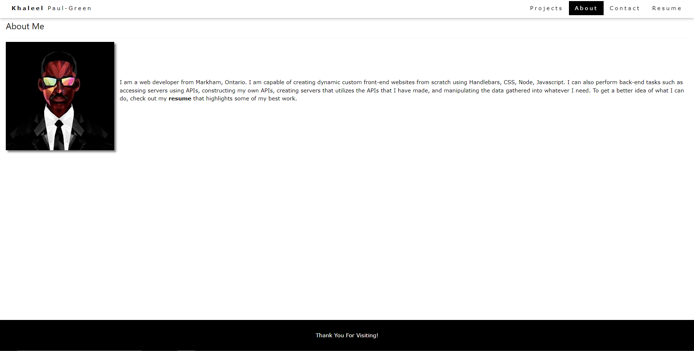

# 20 React: React Portfolio

*this is an older version of my portfolio, refer to repo named 'react-portfolio-updated' for most recent site.

## Table of Contents

* [Description](#description)
* [Deployed Portfolio](#deployed-portfolio)
* [Screenshot](#screenshot)
* [Contact](#contact)

## Description

Using React, I created a personal devloper portfolio that acts to showcases my best work, as I continue to develop my coding skills overtime. Being a web developer means being part of a community, and so it is essential to have a place to share my projects while applying for jobs or simply to share my work with other developers and collaborate on projects.

## Deployed Portfolio

Visit my deployed portfolio [HERE](https://khaleelpaul-green.github.io/react-portfolio/).

## Screenshot

## Contact

For any inquiries regarding my react portfolio, feel free to reach me at [my email](mailto:khaleelpaulgreen.code@gmail.com).
